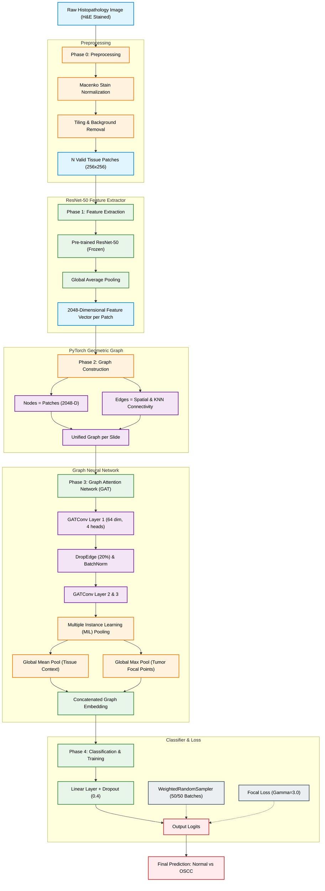

[architecture.md](https://github.com/user-attachments/files/27593721/architecture.md)# Graph-aided-oral-cancer-detection
Graph-based Deep Learning framework for Oral Squamous Cell Carcinoma (OSCC) detection from histopathology images.
This project is a deep learning pipeline I built to classify **Oral Squamous Cell Carcinoma (OSCC)** from histopathology images. 

If you've ever worked with medical imaging—specifically Whole Slide Images (WSIs)—you know they are incredibly massive and complex. Standard Convolutional Neural Networks (CNNs) often struggle here because if you chop an image into patches, the network loses the vital spatial context. A tumor patch doesn't exist in a vacuum; its relationship to the surrounding stroma and healthy tissue is exactly what pathologists look at to make a diagnosis.

To solve this, I decided to treat the tissue not just as a grid of pixels, but as a **Graph**. 

## My Architecture & Pipeline
[Uploading# OSCC Graph Neural Network Architecture

 architecture.md…]()

I broke this project down into a highly modular, four-phase pipeline to make experimentation (and caching) fast and efficient:

### 1. Data Preprocessing & Tiling
First, H&E stained slides can look drastically different depending on the lab that prepared them. I implemented **Macenko Stain Normalization** to standardize the color profiles across the dataset. Then, I tiled the high-resolution images into smaller, manageable patches while actively filtering out white background space using a foreground-ratio threshold.

### 2. Feature Extraction (CNN Backbone)
Instead of training a massive network from scratch, I used a pre-trained **ResNet-50** as a frozen feature extractor. Every single patch is passed through the ResNet backbone, generating a dense 2048-dimensional feature vector. To save hours of computing time, I cached these features locally using `pickle`.

### 3. Graph Construction 
Here is where the magic happens. I built a `GraphConstructor` that turns the extracted patches into a PyTorch Geometric Graph:
* **Nodes:** Each patch is a node, holding the 2048-D feature vector.
* **Edges:** I used a hybrid connectivity approach (combining physical grid adjacency with K-Nearest Neighbors). This allows the network to "see" the tissue architecture just like a pathologist scanning a slide.

### 4. Graph Attention Network (GAT) & Multiple Instance Learning
I passed these graphs into a multi-layer **Graph Attention Network (GAT)**. 
One major hurdle I faced was the **Multiple Instance Learning (MIL)** problem. If a slide has 100 patches, and only 3 contain cancer, taking the *average* prediction of all patches completely washes out the tumor signal. To fix this, I implemented a dual-pooling layer that concatenates both **Global Mean Pooling** (for tissue context) and **Global Max Pooling** (to aggressively catch the most suspicious, highly-activated tumor patches). 

##  Overcoming Class Imbalance

Medical datasets are notoriously imbalanced. In my data, the OSCC images heavily outnumbered the Normal tissue images, which initially caused my model to lazily predict "OSCC" for everything. 

To force the model to learn the minority class, I did two things:
1. **Weighted Random Sampling:** I integrated PyTorch's `WeightedRandomSampler` into the PyG DataLoaders, effectively forcing the model to see a perfect 50/50 split of Normal and OSCC graphs in every single training batch.
2. **Focal Loss:** I threw out standard Cross-Entropy and wrote a custom `FocalLoss` function (with Gamma=3.0). This mathematically forced the optimizer to stop caring about the "easy" OSCC predictions and heavily penalize itself when it got the complex Normal tissue edge-cases wrong.

##  Results & Automated Evaluation

The combination of the GAT, Max-Pooling, and Focal Loss was incredibly effective. The model achieved an **AUC-ROC of ~0.85**. 

Because neural networks output raw probabilities, the default 0.50 cutoff is rarely optimal for imbalanced medical data. So, I wrote an automated evaluation script that dynamically sweeps across probability thresholds to find the mathematical sweet spot that maximizes Accuracy and F1 Score on the unseen test set. 

##  Tech Stack
* **PyTorch & PyTorch Geometric (PyG)** for the deep learning and graph architecture.
* **Scikit-Image & OpenCV** for stain normalization and spatial manipulations.
* **NetworkX** for graph visualizations.
* **Seaborn & Matplotlib** for rendering professional confusion matrices, ROC/PR curves, and attention heatmaps.
